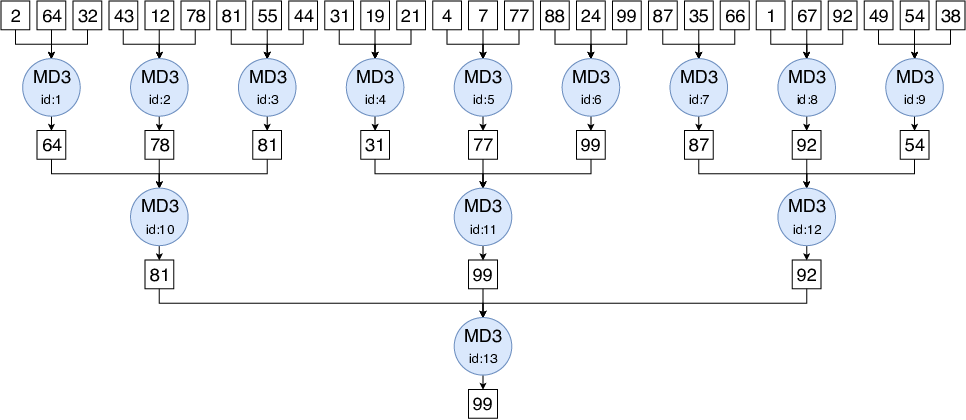
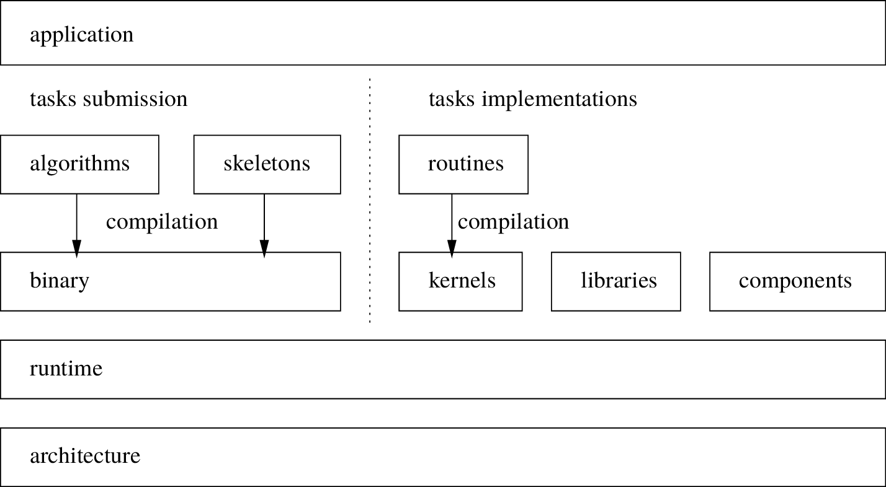
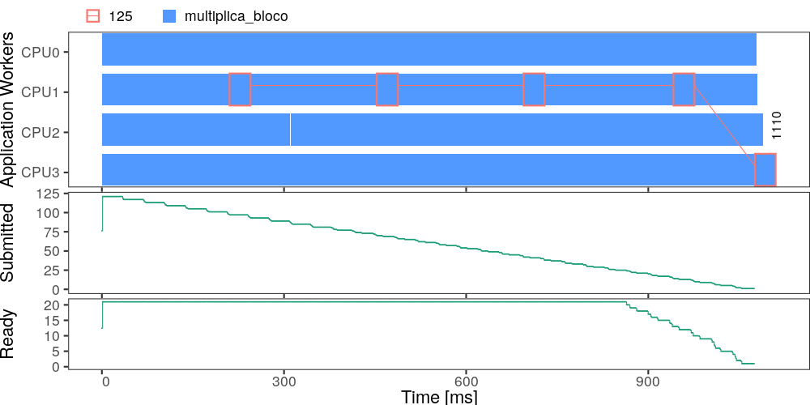

# -*- coding: utf-8 -*-
# -*- mode: org -*-
#+startup: beamer overview indent

#+TITLE: Introduction to Task-Based Parallel Programming with StarPU
#+SUBTITLE: Session 1 — Foundations
#+AUTHOR: Lucas Mello Schnorr, Vinicius Garcia Pinto, Raymond Namyst, Samuel Thibault
#+DATE: CARLA 2026 Advanced Tutorial
#+OPTIONS: H:2 num:t toc:nil \n:nil @:t ::t |:t ^:t -:t f:t *:t <:t title:nil
#+LANGUAGE: en
#+TAGS: noexport(n) ignore(i)
#+EXPORT_EXCLUDE_TAGS: noexport
#+EXPORT_SELECT_TAGS: export

#+LaTeX_CLASS: beamer
#+LaTeX_CLASS_OPTIONS: [presentation, aspectratio=169]
#+BEAMER_THEME: metropolis [numbering=fraction, progressbar=frametitle]
#+LATEX_HEADER: \usepackage{palatino}
#+LATEX_HEADER: \usepackage{tikz}
#+LATEX_HEADER: \usetikzlibrary{positioning,fit,backgrounds,arrows.meta}

#+LaTeX: \setbeamertemplate{navigation symbols}{}
#+LaTeX: \maketitle

* About this deck                                                   :noexport:

Session 1 lecture slides for the StarPU tutorial (09:00-10:30, 90 min).
See =../README.org= for how this session fits into the full-day
schedule.

Target timing (trim the "Find the largest element" walkthrough first
if running long — it is illustrative, not load-bearing):
- Task-based paradigm + DAG structure: ~25 min
- The StarPU runtime model: ~25 min
- Data handles, partitioning, dependencies, scheduling: ~30 min
- Buffer / questions: ~10 min

* Overview
** Where we're going today

- *Session 1 (now)*: the task-based paradigm, and how StarPU implements
  it — no code yet, just the mental model.
- *Session 2*: your first StarPU programs, from a plain sequential
  vector scale to task-based, partitioned matrix addition.
- *Session 3*: heterogeneous CPU/GPU codelets, and seeing what actually
  happened with execution traces (StarVZ).

* Why task-based programming?

** Building a parallel application

Some questions you face when starting to parallelize an application:
- How do I *partition* the work and the data?
- How do the pieces *communicate*?
- How do I *map* pieces onto CPUs/accelerators/nodes?
- If I later add a GPU, or move to a bigger cluster — do I rewrite
  everything?

** The trouble with "classical" parallel programming

With MPI / OpenMP / CUDA written directly:
- *You* decide, in the code, which core or device runs what, and when.
- Adding a new kind of resource (a GPU, a second node) usually means
  touching the core logic again.
- Load balancing across heterogeneous, unequal resources becomes your
  problem, by hand.

** A different strategy: describe the work, not the schedule

Task-based programming (also called *dataflow scheduling*):
- The application is split into well-defined *tasks*.
- The program's structure is submitted to a *runtime system* as a
  *DAG* (Directed Acyclic Graph) of tasks and data dependencies.
- The *runtime* — not your application code — decides scheduling and
  data movement, and can optimize both.

** Advantages and disadvantages

*** Advantages
- Less parallel-programming complexity exposed to the application.
- The runtime can apply optimizations you didn't have to hand-code.
- Adding a new kind of resource is (mostly) the runtime's problem.

*** Disadvantages
- One more layer of complexity: the runtime itself.
- You give up some direct control over execution.
- Behavior can be harder to predict (it depends on runtime decisions).

* The structure of a task-based application

** Three ingredients

Every task-based application, represented as a DAG, is built from:
1. *Tasks*
2. *Data blocks*
3. *Dependencies*

** Tasks

A *unit of computation* — usually sequential code, or a kernel meant to
run on an accelerator.
- Operates on well-defined data blocks.
- Can have *multiple implementations* (e.g., one for CPU, one for GPU).

Examples:
- Multiplying two tiles (blocks) of a matrix.
- Applying one step/equation of a simulation model.

** Data blocks

A *subdivision of the problem's data domain*.
- Used as input and/or output of tasks.
- Each block can be read and/or written by different tasks.

Examples:
- Sub-blocks (tiles) of a matrix.
- A subset of elements being simulated.

** Dependencies between tasks

Dependencies arise from tasks *sharing the same data*.
- A task of type A produces data consumed by two tasks of type B.

#+begin_export latex
\begin{center}
\begin{tikzpicture}[
  taskA/.style={circle, draw, fill=green!15, minimum size=1.1cm},
  taskB/.style={circle, draw, fill=blue!12, minimum size=1.1cm},
]
\node[taskA] (a) {Task A};
\node[taskB, below left=1.3cm and 0.6cm of a] (b1) {Task B};
\node[taskB, below right=1.3cm and 0.6cm of a] (b2) {Task B};
\draw[-{Stealth[length=2mm]}] (a) -- (b1);
\draw[-{Stealth[length=2mm]}] (a) -- (b2);
\begin{scope}[on background layer]
\node[draw, dashed, fit=(a)(b1)(b2), inner sep=0.5cm, label=above:{\small Application}] {};
\end{scope}
\end{tikzpicture}
\end{center}
#+end_export

** Turning a problem into tasks — is it always easy?

Discretizing an algorithm/problem into tasks and data:
- Similar in spirit to the classic PCAM model (Partitioning,
  Communication, Agglomeration, Mapping).
- Not every algorithm is a natural fit — but that does not mean an
  efficient task-based formulation doesn't exist; it may just take
  more thought to find.

** Worked example: finding the largest element

*** The problem
Given a vector of elements, find the largest one.

*** What we need to figure out
- What could a *task* be?
- What could the *data* be?
- What *dependencies* result from that choice?

** Worked example — the task

*Task*: find the largest value in a sub-vector.
- Takes a vector of size $N$.
- Produces: the largest element.
- Call it =MD3= ("max of 3").

** Worked example — the data

*Data*: sub-vectors of the original vector, each of size $N$.
- For this example, we pick $N = 3$.
- The *outputs* of several =MD3= tasks can themselves be grouped into a
  new sub-vector.

** Worked example — the dependencies

Given a vector of 27 elements, we can run =MD3= nine times.
- That produces 9 distinct results.
- Those 9 results can be grouped into 3 new sub-vectors of size 3.
- We can apply =MD3= again on those results — and so on, recursively.

** Worked example — the execution graph

#+ATTR_LATEX: :width 0.9\linewidth :placement [!htpb]

** Worked example — the DAG

#+ATTR_LATEX: :width 0.9\linewidth :placement [!htpb]
[[./img/exemplo_dag_2.pdf]]

** Worked example — where's the parallelism?

Tasks that do *not* share data, and whose dependencies are already
satisfied, can run concurrently.

#+ATTR_LATEX: :width 0.9\linewidth :placement [!htpb]
[[./img/exemplo_dag_2.pdf]]

* Runtimes

** What is a runtime, here?

A *runtime system* executes the DAG you described, instead of you
scheduling it by hand.

Widely used in HPC already:
- OpenMP, MPI

Runtimes specifically built around task graphs:
- PaRSEC, OmpSs, OpenMP (tasking, >=4.0), XKaapi, *StarPU*

** What do you gain, what do you lose?

*** Advantages
- Automatic scheduling decisions based on the DAG.
- Automatic mapping of tasks to resources.
- Automatic discovery of parallelism opportunities.
- Automatic data movement between memories.

*** Disadvantages
- Runtime *overhead*.
- Reduced direct control over execution.

* The StarPU runtime

** What is StarPU?

A general-purpose, task-based runtime system.
- Targets parallel applications on heterogeneous, multicore machines.
- Developed at Université de Bordeaux / Inria.
- C/C++/Fortran interface for submitting tasks onto resources.

** Where StarPU sits in the software stack

# KNOWN GAP: starpu_modelo.png is entirely labeled in Portuguese
# ("Aplicação", "Submissão de Tarefas", "Implementação de Tarefas",
# "Algoritmos", "Esqueleto", "Compilação", "Binário", "Kernels",
# "Bibliotecas", "Componentes", "Runtime", "Arquitetura"). No editable
# source (only .png/.pdf) was found to redraw it in English — either
# recreate it in English before presenting, or narrate the boxes
# verbally in the meantime.
#+ATTR_LATEX: :width 0.85\linewidth

\scriptsize
\center
Adapted from Thibault, 2018

** The STF model

StarPU uses the *Sequential Task Flow* (STF) model:
- The application submits tasks *sequentially, as it runs*; the runtime
  schedules them onto resources *dynamically*.
- The whole DAG does *not* need to be known in advance.
- Tasks can be submitted gradually, as execution proceeds.

** Workers

A *worker* is the processing entity that actually executes a task.
- Each computing resource has one or more workers.

# KNOWN GAP: runtime.pdf still has two Portuguese labels ("Recursos",
# "Escalonador") baked into the image (worker boxes and CPU/GPU labels
# are already in English/neutral). Redraw in English before presenting,
# or narrate the two labels verbally in the meantime.
#+ATTR_LATEX: :width 0.5\linewidth
[[./img/runtime.pdf]]

** Implementations and codelets

Heterogeneous resources need different implementations of the same
task.
- Tasks are structured as *codelets*, which may hold one implementation
  per resource type (CPU, CUDA, OpenCL, ...).
- *Which* implementation actually runs is decided by the runtime, at
  execution time.

(This is exactly what you will extend by hand in Session 3.)

** How StarPU structures a task-based program

- Tasks are described as *codelets*.
- Memory blocks are described as *data handles*.
- Dependencies are computed *implicitly*, from data reuse and
  submission order — you do not write them explicitly.

(This is exactly what you will build by hand in Session 2.)

** Scheduling strategies

Several schedulers are available, selectable at runtime:
- =lws= — local work-stealing
- =eager= — single centralized task queue
- =dm= — deque model, based on the HEFT heuristic
- =dmda= — deque model, data-aware

Selected via the =STARPU_SCHED= environment variable — no code change
needed to try a different one.

** Analyzing performance

StarPU applications can be analyzed using execution *traces*:
- The FxT format records fine-grained runtime events.
- Traces can be converted to other formats (e.g. Paje) for
  visualization.

#+ATTR_LATEX: :width 0.5\linewidth :placement [!htb]

This is exactly what Session 3, Part B, walks you through with StarVZ.

* Wrap-up

** What's next

You now have the vocabulary for Session 2:
- *Codelet*, *data handle*, *task*, implicit *dependency*.

In Session 2 you will:
1. Read and run three progressively richer StarPU programs.
2. Write a partitioned block-matrix-addition program from a skeleton.

Questions before the break?
